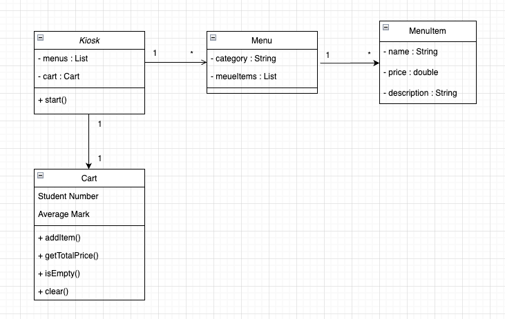

# Kiosk
## 프로젝트 개요
이 프로그램은 콘솔 창에서 동작하는 미니 키오스크 애플리케이션입니다.  
메모리 기반 저장 방식을 사용하므로, 프로그램 종료 시 모든 데이터가 삭제됩니다.

### 주요 기능
- 메뉴 카테고리 출력 및 선택 (버거 · 음료 · 디저트)
- 장바구니에 메뉴 추가 · 조회 · 삭제
- 주문 처리 : 장바구니 확인 후 결제 또는 취소
- 할인 적용 : 국가유공자 · 군인 · 학생 · 일반별 할인율 계산
- 주문 완료 시 결제 금액 출력 및 장바구니 초기화

### 클래스 다이어그램
